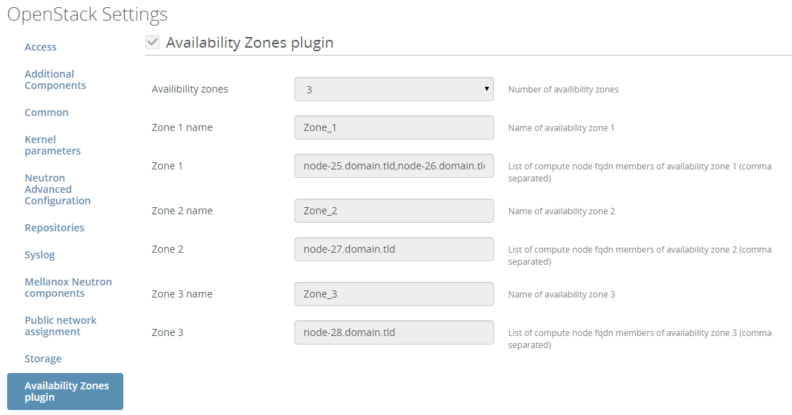

Fuel availability-zones plugin for Fuel
=============================

availability-zones plugin
---------------

Overview
--------
Openstack can configure availability zones as logical groups for compute nodes, this plugin allow to configure from 1 to 4 availability zones

This repo contains all necesary files to build availability-zones Fuel plugin.

Requirements
------------

| Requirement                      | Version/Comment                                         |
|----------------------------------|---------------------------------------------------------|
| Mirantis Openstack compatibility | 7.0                                                     |
|----------------------------------|---------------------------------------------------------|

Recommendations
---------------

None.

Limitations
-----------

Only 4 availability zones can be defined. 
Zone's name can't contain white space character / specials characters
Zone members must be defined by their full and correct hostname

Installation Guide
==================

availability-zones plugin installation
----------------------------

1. Clone the fuel-plugin repo from: https://github.com/stackforge/fuel-plugin-availability-zones.git

    ``git clone``

2. Install the Fuel Plugin Builder:

    ``pip install fuel-plugin-builder``

3. Build availability-zones Fuel plugin:

   ``fpb --build fuel-plugin-availability-zones/``

4. The availability-zones-<x.x.x>.rpm file will be created in the plugin folder (fuel-plugin-availability-zones)

5. Move this file to the Fuel Master node with secure copy (scp):

   ``scp availability-zones-<x.x.x>.rpm root@:<the_Fuel_Master_node_IP addres>:/tmp``
   ``cd /tmp``

6. Install the availability-zones plugin:

   ``fuel plugins --install availability-zones-<x.x.x>.rpm``
   
7.  Verify that the plugin is installed correctly:
   ``fuel plugins --list``
   
8. Plugin is ready to use and can be enabled on the Settings tab of the Fuel web UI.

User Guide
==========

availability-zones plugin configuration
-----------------------------

1. Create a new environment with the Fuel UI wizard

2. Add multiples nodes with the "Compute" role.

3. Click on the settings tab of the Fuel web UI

4. Scroll down the page, select the "availability-zones plugin" checkbox
   and fill-in the requiered fields
    - Choose the number of availability zone (from 1 to 4)
    - For each zone you can configure the name of it (/!\ no special characters allowed)
	- For each zone you must fill the member list with fqdn of compute node separated by comma 
	(eg: node-25.domain.tld,node-26.domain.tld)

Here is a screenshot of the fields

Deployment details
------------------

Create each availability zone
Add host each host to the correct availability zone
If some compute nodes are not present in this custom availability zones, 
they will be member of default availability zone (nova, defined by Fuel)

Known isues
------------

-

Release Notes
-------------

**1.0.0**

* Initial release of the plugin

